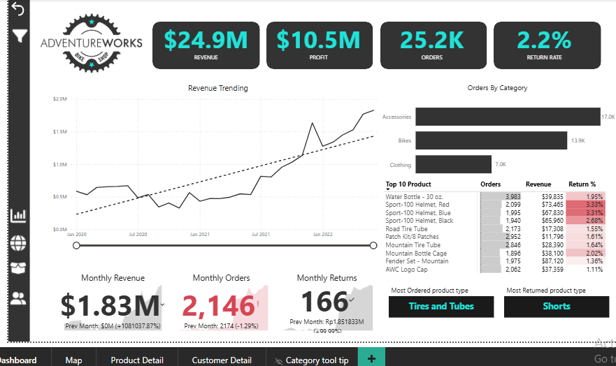
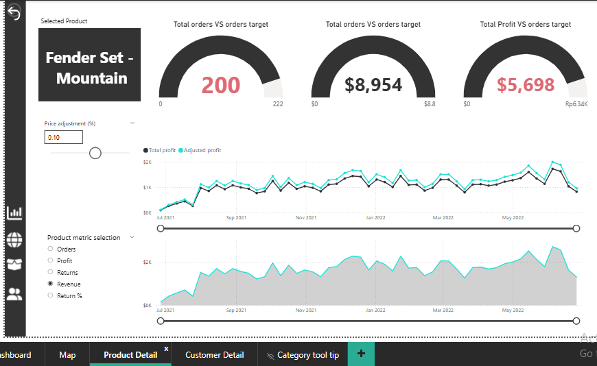
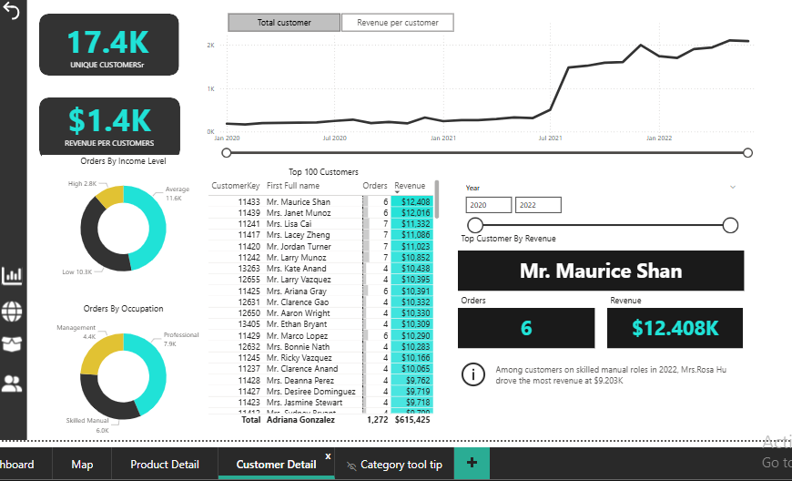

# AdventureWorks Sales Dashboard

## Project Overview
This project analyzes the AdventureWorks dataset to understand business performance through an interactive Power BI dashboard. The dashboard visualizes key metrics such as revenue, profit, orders, and customer insights to help identify trends and business opportunities.

## Dataset
The dataset used in this project is the AdventureWorks sample database, which contains information about sales, products, customers, and transactions.

## Tools Used
- Power BI
- DAX
- Data Modeling
- Data Visualization

## Key Features
- Revenue, Profit, Orders, and Return Rate KPI tracking
- Monthly revenue trend analysis
- Product category performance analysis
- Customer revenue distribution
- Interactive filters and slicers for deeper data exploration

## Dashboard Preview
## Dashboard Preview

## Key Insights
- Revenue trends can be tracked over time to identify peak sales periods.
- Certain product categories contribute more significantly to overall profit.
- Customer purchase patterns reveal important business opportunities.

## Purpose of the Project
The goal of this project is to demonstrate how raw business data can be transformed into meaningful insights through data visualization and business intelligence tools.

